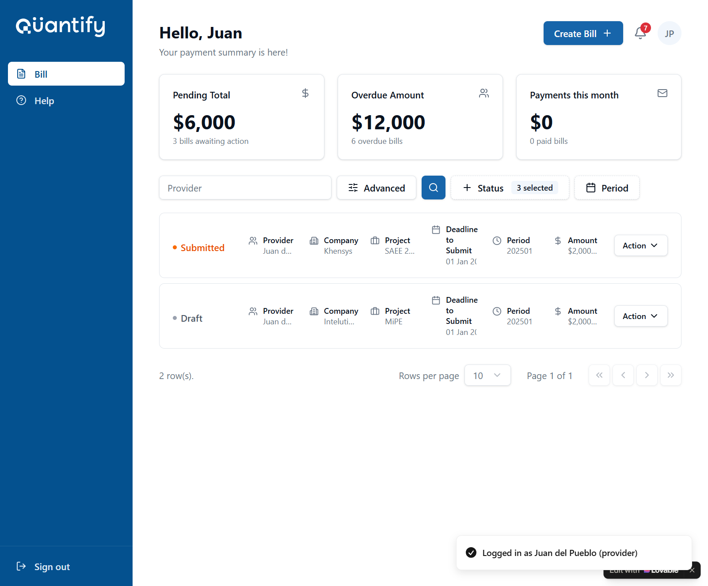
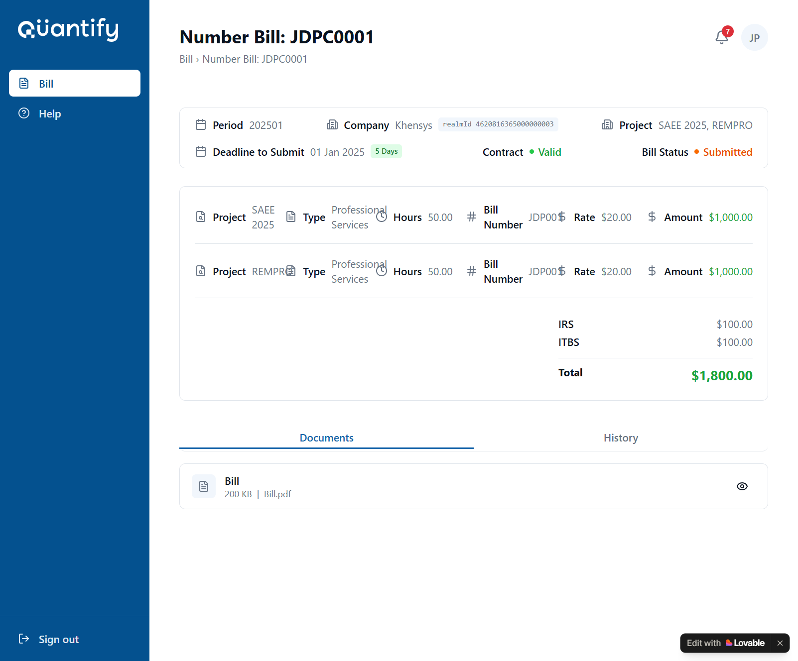
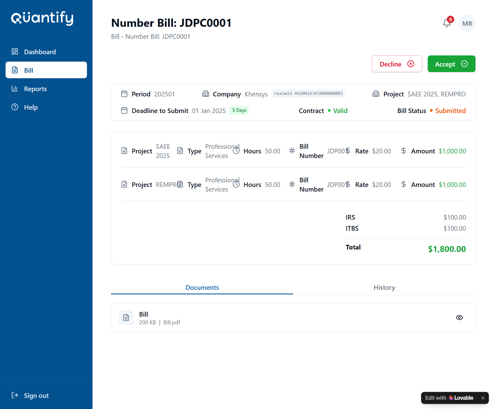
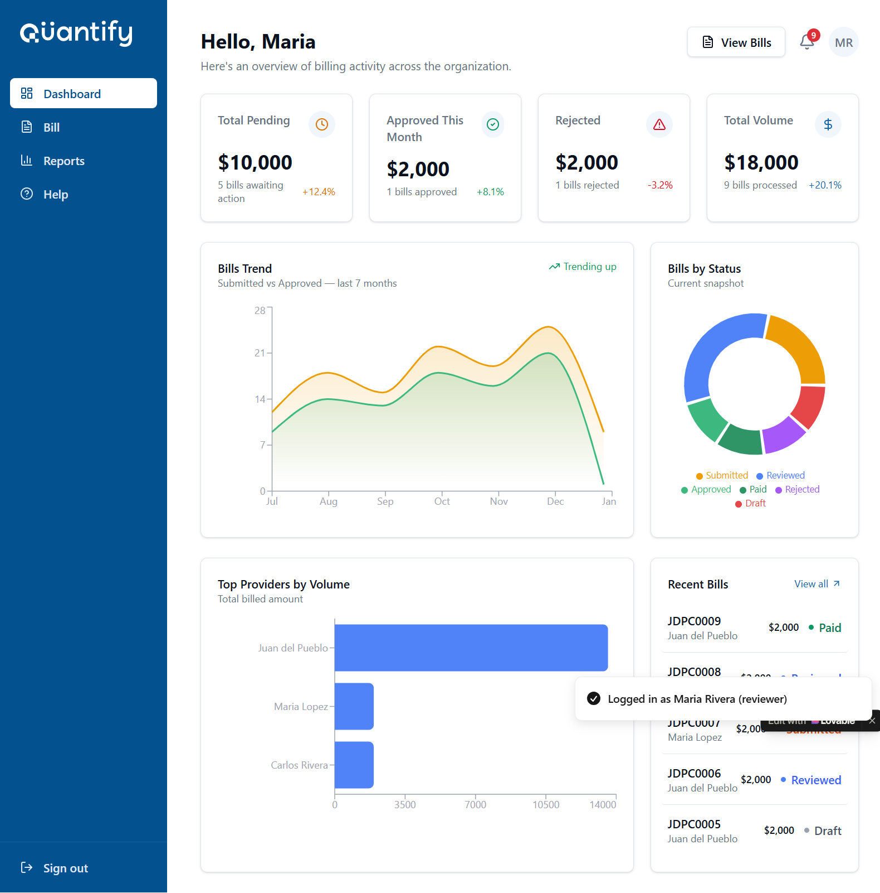
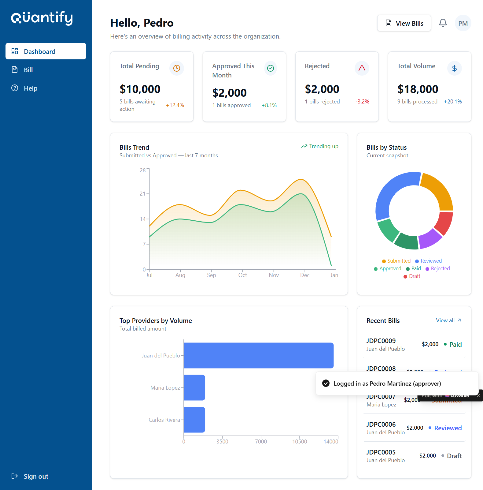
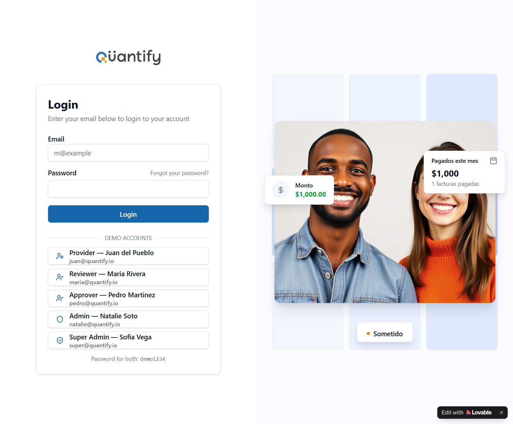
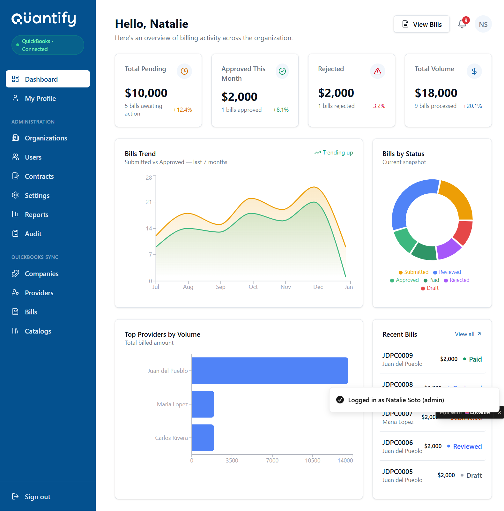

# Quantify 2.0 — Reporte de Mejoras de Diseño Funcional

> **Fecha de análisis:** 27 julio 2026  
> **URL analizada:** https://id-preview--8e5862b0-a029-4fd3-8caf-60798151eca1.lovable.app  
> **Roles revisados:** Provider · Reviewer · Approver · Admin · Super Admin  
> **Metodología:** Inspección visual + análisis de accesibilidad funcional por pantalla

---

## Resumen Ejecutivo

Se identificaron **15 mejoras** distribuidas en 3 niveles de prioridad. Las más críticas afectan directamente flujos de trabajo del día a día (Provider creando facturas, Reviewer revisando), exponen datos internos del sistema, o generan confusión de contexto entre roles. Las de prioridad media generan fricción. Las de baja prioridad son de pulido visual.

| Prioridad | Cantidad | Descripción general |
|-----------|----------|---------------------|
| 🔴 Alta   | 6        | Impacto directo en flujos críticos |
| 🟡 Media  | 6        | Fricción y confusión de rol |
| 🟢 Baja   | 3        | Pulido y consistencia |

---

## 🔴 ALTA PRIORIDAD

---

### #1 — Texto truncado en la lista de bills hace la información ilegible

**Pantalla:** Bills list (Provider y Reviewer)



**Problema:**  
Todos los campos clave de la lista de bills se truncan con puntos suspensivos: el nombre del proveedor muestra "Juan d...", la empresa muestra "Inteluti...", el proyecto muestra "SAEE 2...", y el monto muestra "$2,000...". Esto obliga al usuario a entrar a cada bill individualmente para conocer datos que deberían ser visibles de un vistazo.

**Impacto funcional:**  
- El Reviewer no puede identificar un bill sin abrirlo.  
- Con múltiples bills con el mismo proveedor o similar monto, la distinción es imposible desde la lista.  
- Aumenta considerablemente el tiempo de revisión al requerir clics adicionales.

**Mejora sugerida:**  
Rediseñar las filas de la lista usando una estructura de 2 líneas (similar a Gmail o Jira):
- **Línea 1 (bold):** Número de bill + Empresa + Estado  
- **Línea 2 (small/gray):** Proveedor | Proyecto(s) | Período | Monto  
Esto aprovecha el espacio vertical sin necesidad de truncar. Alternativamente, usar un layout de tarjetas (cards) en lugar de tabla si el volumen de datos lo permite.

---

### #2 — Los ítems de línea del bill usan un layout horizontal tan comprimido que resultan ilegibles

**Pantalla:** Bill Detail (Provider y Reviewer)




**Problema:**  
Cada línea de factura muestra todos sus campos en una sola fila horizontal: `Project | Type | Hours | Bill Number | Rate | Amount`. Esto genera que:
- Los valores se compriman ("SAEE 2025" aparece como "SAEE 2025" con overflow o truncado)
- El "Bill Number" (JDP001) usa el símbolo `#` como ícono, que no comunica nada claro
- En pantallas medianas o con muchos proyectos, la legibilidad es prácticamente nula

**Impacto funcional:**  
- El Reviewer no puede auditar rápidamente si los valores son correctos.  
- El Approver necesita validar monto × horas × rate — en una sola fila horizontal es difícil verificar la fórmula visualmente.

**Mejora sugerida:**  
Usar una tabla estructurada por línea con columnas claramente definidas y alineación numérica:

| Proyecto | Tipo | Horas | # Bill | Rate | Monto |
|----------|------|-------|--------|------|-------|
| SAEE 2025 | Prof. Services | 50.00 | JDP001 | $20.00 | $1,000.00 |
| REMPRO | Prof. Services | 50.00 | JDP001 | $20.00 | $1,000.00 |

Los montos deben estar alineados a la derecha. El encabezado de columnas debe ser visible siempre.

---

### #3 — El "realmId" de QuickBooks se muestra como dato visible para el usuario final

**Pantalla:** Bill Detail (todos los roles)


**Problema:**  
En el campo "Company" dentro del detalle del bill, se muestra un badge con el texto `realmId 4620816365000000003`. Este es un identificador interno de QuickBooks Online — un dato técnico del sistema que el usuario final (Provider, Reviewer, Approver) no necesita ver y que además genera confusión.

**Impacto funcional:**  
- Crea ruido visual que distrae de la información relevante.
- Puede generar preguntas de soporte ("¿Qué es ese número?").
- Es un anti-patrón de seguridad/UX: exponer IDs internos a usuarios no técnicos.

**Mejora sugerida:**  
Remover el badge completamente de la vista del usuario final. Si es necesario para soporte/debug, moverse a:
- Una sección "Información técnica" colapsada (accordion) en la vista Admin.
- O solo en el panel Admin del sistema, no en la vista de rol operativo.

---

### #4 — El botón "Action" no revela las acciones disponibles hasta que se hace clic

**Pantalla:** Bills list (todos los roles)


**Problema:**  
Cada fila de la lista de bills tiene un botón "Action ▼" que al hacer clic despliega las acciones disponibles. El problema es que el usuario no sabe qué acciones existen sin hacer clic. Para un Provider, las acciones posibles son diferentes que para un Reviewer (el Provider puede "Edit/Delete" un Draft, el Reviewer puede "Accept/Decline"). Al no ver las etiquetas, el usuario necesita explorar para descubrir qué puede hacer.

**Impacto funcional:**  
- El Reviewer que necesita aceptar 10 bills debe hacer clic en "Action" + clic en "Accept" por cada uno = 20 clics extra.
- Oculta la disponibilidad de acciones, lo que baja la percepción de capacidad de la herramienta.

**Mejora sugerida:**  
Para roles con acción primaria clara (Reviewer → Accept/Decline), mostrar botones directamente en la fila:

```
[ ✓ Accept ]  [ ✗ Decline ]     [···]  (más acciones)
```

Para el Provider en estado Draft:
```
[ ✏ Edit ]   [ ✈ Submit ]     [···]
```

Esto reduce el número de clics y hace el flujo de revisión masiva mucho más eficiente.

---

### #5 — Reviewer y Approver tienen dashboards idénticos que no diferencian su rol

**Pantalla:** Dashboard (Reviewer vs Approver)




**Problema:**  
El dashboard del Reviewer (María Rivera) y el del Approver (Pedro Martínez) son **visualmente idénticos**: mismos KPI cards, mismo gráfico "Bills Trend", mismo donut "Bills by Status", misma sección "Recent Bills" y "Top Providers by Volume". La única diferencia es el nombre. Esta identidad no refleja la diferencia funcional entre los dos roles:
- El Reviewer debe enfocarse en **bills pendientes de revisión**.
- El Approver debe enfocarse en **bills revisados pendientes de aprobación**.
- El Reviewer tiene acceso a "Reports" en el sidebar; el Approver no.

**Impacto funcional:**  
- El Approver ve KPIs que no corresponden a su queue ("Bills awaiting action" mezcla Submitted y Reviewed).
- Ambos roles podrían sentir que su dashboard "no es para ellos".
- El "Total Pending" en Approver debería mostrar solo los que están en estado "Reviewed" (listos para él), no los "Submitted" que corresponden al Reviewer.

**Mejora sugerida:**  
Diferenciar el contexto del dashboard por rol:
- **Reviewer Dashboard:** "Bills en Cola de Revisión", prioridad por fecha de vencimiento, métricas de velocidad de revisión.
- **Approver Dashboard:** "Bills Revisados Pendientes de Aprobación", métricas de aprobación/rechazo mensual.
- Los KPI cards deben filtrar por el estado relevante al rol, no mostrar totales globales.

---

### #6 — El contador "5 Days" en "Deadline to Submit" no indica si es tiempo restante o días de retraso

**Pantalla:** Bills list y Bill Detail (todos los roles)


**Problema:**  
En la columna "Deadline to Submit" aparece la fecha `01 Jan 2025` junto a un badge verde que dice `5 Days`. No hay contexto suficiente para entender si:
- Quedan 5 días para llegar a la fecha límite (urgencia media)
- Hace 5 días que venció la fecha (overdue)

Agravante: la fecha `01 Jan 2025` está en el pasado desde la perspectiva de datos de demo, lo que hace más confuso el "5 Days".

**Impacto funcional:**  
- El Provider no sabe si está a tiempo o ya está tarde.
- El Reviewer no puede priorizar correctamente sin contexto de urgencia.

**Mejora sugerida:**  
Usar indicadores explícitos con color y texto:
- Si quedan días: badge verde `⏱ 5 días restantes`
- Si está próximo a vencer (< 3 días): badge amarillo/naranja `⚠ Vence en 2 días`
- Si ya venció: badge rojo `🔴 Venció hace 5 días` (con ícono de alerta)

---

## 🟡 MEDIA PRIORIDAD

---

### #7 — La pantalla de login mezcla idiomas (español en overlays UI, inglés en la app)

**Pantalla:** Login



**Problema:**  
El panel derecho del login muestra overlays con texto en español: "Pagados este mes", "Sometido", "Monto $1,000.00". La app completa está en inglés. Esta inconsistencia ocurre porque los overlays decorativos usan datos en español del backend (el campo `estado` probablemente tiene el valor "Sometido" en lugar de "Submitted").

**Mejora sugerida:**  
Unificar el idioma. Si la app es bilingüe, definir el idioma de UI por preferencia de usuario. Si solo es en inglés, los datos del sistema deben estar en inglés. Los overlays decorativos del login deben usar datos en inglés que reflejen realmente el valor de la plataforma.

---

### #8 — El título de la página muestra "Number Bill: JDPC0001" que es redundante y verboso

**Pantalla:** Bill Detail (todos los roles)


**Problema:**  
El título del detalle de un bill dice `Number Bill: JDPC0001`. La palabra "Number" es redundante — "Bill: JDPC0001" ya implica que JDPC0001 es el número. También aparece en el breadcrumb con la misma redundancia. En inglés suena a "traducción literal" del español "Número de Factura".

**Mejora sugerida:**  
Simplificar a `Bill JDPC0001` o `JDPC0001` (si el contexto del breadcrumb ya indica "Bill"). El breadcrumb sería: `Bill > JDPC0001`.

---

### #9 — El campo de búsqueda "Provider" en la lista de bills del Provider es contextualmente incorrecto

**Pantalla:** Bills list (Provider)


**Problema:**  
El campo de búsqueda de la lista de bills dice `Provider` como placeholder. El Provider siempre está viendo sus propios bills — nunca buscaría "por proveedor" porque solo hay uno: él mismo. Este campo tiene sentido para Reviewer y Admin (que ven bills de múltiples proveedores), pero no para el Provider.

**Impacto funcional:**  
Crea confusión sobre qué se puede buscar. El Provider podría pensar que es un filtro irrelevante y no usarlo.

**Mejora sugerida:**  
Para el rol Provider, cambiar el placeholder a `Search by company, project, or period…` o simplemente `Search bills…`. El filtro por "Provider" solo debe aparecer para roles que ven bills de múltiples proveedores.

---

### #10 — El ícono de "Overdue Amount" en el dashboard del Provider es un sobre de email

**Pantalla:** Bills list / Dashboard Provider


**Problema:**  
El KPI card "Overdue Amount" usa un ícono de sobre/envelope (`✉`). Un sobre de email no tiene relación semántica con bills vencidos o montos. Los demás cards usan: `$` para Pending Total y `✉` para Payments. El ícono correcto para "Overdue" debería comunicar urgencia o tiempo.

**Mejora sugerida:**  
Usar un ícono de reloj con alerta (`⏰` o un clock con exclamación) o un ícono de calendario vencido para "Overdue Amount". Para "Payments this month" usar un check con círculo (✅) o una flecha hacia arriba (`↑`).

---

### #11 — El badge "QuickBooks · Connected" en el sidebar del Admin parece un ítem de navegación

**Pantalla:** Admin Dashboard



**Problema:**  
En la parte superior del sidebar del Admin aparece un badge verde que dice "QuickBooks · Connected". Este componente visualmente parece un botón de navegación (tiene borde redondeado, color destacado y está en la posición donde normalmente van los items del menú). Un usuario podría intentar hacer clic esperando navegar a una sección, o simplemente confundirlo con un elemento de nav activo.

**Mejora sugerida:**  
Mover el estado de la conexión de QuickBooks a:
1. Una sección inferior del sidebar o cerca de los items "QUICKBOOKS SYNC".
2. O como indicador de estado dentro de la sección "QUICKBOOKS SYNC" (un punto verde junto al título de sección).
3. El estado de integración no debe estar en la posición prominente superior del sidebar.

---

### #12 — Los usuarios Admin y Reviewer tienen acceso a "Reports" pero no hay diferenciación visual de qué contiene cada uno

**Pantalla:** Admin Dashboard / Reviewer sidebar


**Problema:**  
Tanto el Admin como el Reviewer tienen un item "Reports" en el sidebar, pero en la vista del Admin "Reports" está bajo la sección "ADMINISTRATION" (junto a Audit), mientras que en el Reviewer está al mismo nivel que Dashboard y Bill. No está claro si ambos roles ven el mismo reporte o reportes diferentes. El Approver no tiene Reports en absoluto.

**Impacto funcional:**  
- Un Reviewer podría intentar acceder a datos de Admin.
- Un Approver que necesita verificar tendencias no tiene acceso desde su rol.

**Mejora sugerida:**  
Usar nombres diferenciados:
- Reviewer: "My Review Activity" o "Review Reports"
- Admin: "Organization Reports" o "Management Reports"
- Añadir un tooltip o descripción breve junto al item del sidebar para clarificar el alcance.

---

## 🟢 BAJA PRIORIDAD

---

### #13 — La foto de stock del login no agrega valor y usa espacio valioso

**Pantalla:** Login


**Problema:**  
El panel derecho del login muestra una foto de stock de dos personas sonriendo, con overlays de UI superpuestos. Esta imagen es genérica (no está relacionada con la industria de facturas/servicios profesionales) y la combinación con los overlays de UI no comunica claramente el valor de Quantify.

**Mejora sugerida:**  
Reemplazar con una ilustración o mockup real de la app que muestre un flujo clave (ej: el dashboard del Reviewer mostrando métricas reales), o con un value proposition visual: "X facturas procesadas este mes · $Y en pagos". Esto da contexto inmediato del sistema.

---

### #14 — El placeholder del campo Email dice "m@example" sin TLD (.com)

**Pantalla:** Login

**Problema:**  
El campo Email tiene placeholder `m@example` — le falta el `.com` al final. Un email válido de ejemplo debe ser al menos `m@example.com`. Aunque es un detalle menor, puede generar confusión en usuarios menos técnicos.

**Mejora sugerida:**  
Cambiar placeholder a `m@example.com` o `usuario@empresa.com`.

---

### #15 — La pestaña "History" en el detalle del bill está oculta y es difícil de descubrir

**Pantalla:** Bill Detail (todos los roles)


**Problema:**  
El historial de cambios de un bill (quién lo creó, quién lo revisó, cuándo cambió de estado) está en la pestaña "History", que está debajo de todo el contenido del bill y que por defecto está en la pestaña "Documents". Para un Reviewer o Approver que quiere ver el historial de un bill antes de tomar una decisión, este dato está oculto e implica scroll hacia abajo + cambio de tab.

**Impacto funcional:**  
El historial de auditoría es crítico para decisiones de aprobación — si un bill fue rechazado anteriormente y resubmitido con cambios, el Reviewer debe saberlo. Tenerlo tan escondido reduce su uso.

**Mejora sugerida:**  
- Mostrar el historial de estados (timeline) como una sección permanente visible en la parte derecha del layout (sidebar del detalle), no como tab secundario.
- O promover "History" al mismo nivel visual que el contenido principal, con un diseño de timeline compacto (fecha + acción + usuario).

---

## Resumen Visual por Pantalla

| Pantalla | Issues encontrados |
|----------|--------------------|
| Login | #7 (idioma mixto), #13 (foto stock), #14 (placeholder email) |
| Provider - Bills list | #1 (truncado), #4 (Action dropdown), #6 (deadline badge), #9 (búsqueda Provider), #10 (ícono Overdue) |
| Provider - Bill Detail | #2 (layout ítems), #3 (realmId), #8 (título verboso), #15 (History tab) |
| Provider - Create Bill | #2 (layout ítems) |
| Reviewer - Dashboard | #5 (dashboard idéntico), #12 (Reports sin diferenciación) |
| Reviewer - Bills list | #1 (truncado), #4 (Action dropdown), #6 (deadline badge) |
| Reviewer - Bill Detail | #2 (layout ítems), #3 (realmId), #8 (título verboso), #15 (History tab) |
| Approver - Dashboard | #5 (dashboard idéntico), #12 (Reports ausente) |
| Admin - Dashboard | #11 (QBO badge nav), #12 (Reports Admin vs Reviewer) |
| Super Admin - Organizations | — (pantalla bien estructurada, sin issues críticos) |

---

## Mejora Bonus — Flujo de revisión masiva

**Contexto:**  
En un ciclo de facturación, el Reviewer puede recibir 10-20 bills al mismo tiempo. Actualmente debe: abrir cada bill → revisar → hacer clic en "Action" → "Accept" → volver a la lista → abrir el siguiente. Son ~5 clics + tiempo de carga por bill.

**Propuesta:**  
Agregar una vista de **"Revisión rápida"** (similar a Gmail's reading pane) donde al hacer clic en un bill de la lista, el detalle aparece en un panel lateral sin navegar a otra página. Los botones "Accept / Decline" quedan accesibles sin abandonar la lista, permitiendo procesar múltiples bills en un solo flujo continuo.

---

*Reporte generado el 27 julio 2026 con base en análisis de diseño funcional de la versión Lovable preview.*
