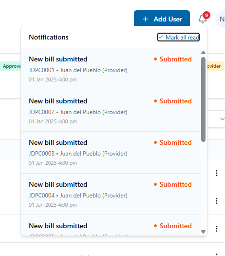
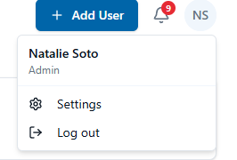
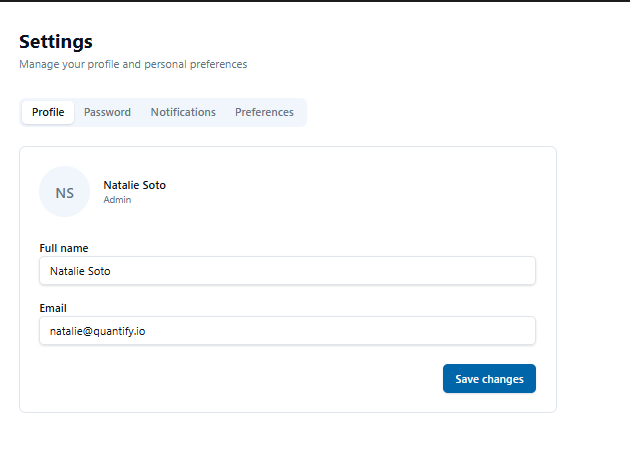

# UI/UX — Mapa de Pantallas

> ⚠️ Este archivo se auto-carga al inicio de cada sesión (vía `@context/UI-UX.md` en `CLAUDE.md`).
> Contiene el mapa de pantallas reales de la aplicación para que el agente redacte Test Cases sin suponer labels, rutas ni comportamientos.

**Cómo se llena:** usa el skill `project-onboarding` — adjunta screenshots de las pantallas y el agente generará una entrada por cada una, guardando la imagen en `context/screenshots/`.

**Regla para el agente:** antes de redactar steps de un TC sobre una pantalla, busca su entrada aquí. Si no existe, NO supongas el diseño — pide un screenshot al usuario o inspecciona la app real vía MCP Browser antes de redactar el TC.

---

## Formato de cada entrada

Copia este bloque por cada pantalla nueva:

```markdown
## [Portal] > [Módulo] > [Nombre de pantalla]
- **Ruta/URL:** ...
- **Cómo se llega aquí:** [pantalla origen + acción/botón exacto]
- **Elementos clave:**
  | Elemento | Tipo | Texto/label literal | Comportamiento |
  |---|---|---|---|
  | ... | botón | "Guardar" | abre modal de confirmación |
- **Estados:** vacío / con datos / error / loading
- **Screenshot:** 
- **Notas para TCs:** [detalles relevantes]
---
```

---

## Pantallas documentadas

## Quantify > Home > Inicio
- **Ruta/URL:** `http://localhost:3000/` (`/`)
- **Cómo se llega aquí:** acceso directo / URL base
- **Elementos clave:**
  | Elemento | Tipo | Texto/label literal | Comportamiento |
  |---|---|---|---|
  | Título | heading | `"Quantify"` | — |
  | Saludo (autenticado) | texto | `"Bienvenido, [nombre o email]"` | visible solo si autenticado |
  | Botón iniciar sesión | botón | `"Iniciar sesión"` | visible solo si NO autenticado; redirige a `/auth/keycloak` |
  | Botón cerrar sesión | botón | `"Cerrar sesión"` | visible solo si autenticado; ejecuta logout |
- **Estados:**
  - No autenticado: muestra título + botón `"Iniciar sesión"`
  - Autenticado: muestra título + saludo con nombre/email + botón `"Cerrar sesión"`
- **Screenshot:** _(pendiente)_
- **Notas para TCs:** La página detecta el estado de auth automáticamente al cargar. El saludo usa `name` del token; si no existe, usa `email`.
---

## Quantify > Auth > Redirect Login
- **Ruta/URL:** `http://localhost:3000/login` (`/login`)
- **Cómo se llega aquí:** navegación directa a `/login`
- **Elementos clave:**
  | Elemento | Tipo | Texto/label literal | Comportamiento |
  |---|---|---|---|
  | Texto de transición | enlace/texto | `"Redirigiendo a Keycloak..."` | visible brevemente antes del redirect |
- **Estados:** pantalla transitoria — redirige automáticamente a `/auth/keycloak` al montar
- **Screenshot:** _(pendiente — pantalla transitoria)_
- **Notas para TCs:** No requiere autenticación (`auth: false`). El redirect es inmediato via `onMounted`.
---

## Quantify > Auth > Bienvenida (post-login)
- **Ruta/URL:** `http://localhost:3000/welcome` (`/welcome`)
- **Cómo se llega aquí:** automáticamente tras login exitoso en Keycloak → callback → redirect a `/welcome`
- **Elementos clave:**
  | Elemento | Tipo | Texto/label literal | Comportamiento |
  |---|---|---|---|
  | Título | heading h1 | `"Bienvenido a Quantify"` | — |
  | Confirmación | párrafo | `"Autenticación exitosa."` | — |
  | Usuario | lista item | `"Usuario: [preferred_username o email]"` | valor dinámico del token |
  | Nombre | lista item | `"Nombre: [name]"` | valor dinámico del token |
  | Email | lista item | `"Email: [email]"` | valor dinámico del token |
  | Botón cerrar sesión | botón | `"Cerrar sesión"` | ejecuta logout de Keycloak + limpia sesión |
- **Estados:** solo accesible si autenticado (protegida por middleware OIDC)
- **Screenshot:** _(pendiente)_
- **Notas para TCs:** Muestra datos reales del JWT. El campo "Usuario" usa `preferred_username`; si no existe, cae a `email`. Requiere sesión activa de Keycloak.
---

---

## Quantify > Auth > Login
- **Ruta/URL:** `/` o `/login` (pantalla de acceso inicial)
- **Cómo se llega aquí:** acceso directo a la URL raíz cuando el usuario no está autenticado
- **Elementos clave:**
  | Elemento | Tipo | Texto/label literal | Comportamiento |
  |---|---|---|---|
  | Logo | imagen | `"Quantify"` | — |
  | Título | heading | `"Login"` | — |
  | Subtítulo | párrafo | `"Enter your email below to login to your account"` | — |
  | Campo email | input text | `"Email"` / placeholder `"m@example"` | — |
  | Campo password | input password | `"Password"` | — |
  | Enlace olvidar contraseña | enlace | `"Forgot your password?"` | — |
  | Botón login | botón primario | `"Login"` | autentica y redirige según rol |
  | Sección cuentas demo | sección | `"DEMO ACCOUNTS"` | lista accesos rápidos por rol |
  | Cuenta Provider | botón demo | `"Provider — Juan del Pueblo"` / `"juan@quantify.io"` | rellena credenciales automáticamente |
  | Cuenta Reviewer | botón demo | `"Reviewer — Maria Rivera"` / `"maria@quantify.io"` | rellena credenciales automáticamente |
  | Cuenta Approver | botón demo | `"Approver — Pedro Martinez"` / `"pedro@quantify.io"` | rellena credenciales automáticamente |
  | Cuenta Admin | botón demo | `"Admin — Natalie Soto"` / `"natalie@quantify.io"` | rellena credenciales automáticamente |
  | Nota password | texto | `"Password for both: demo1234"` | contraseña compartida para cuentas demo |
- **Estados:** pantalla pública (sin autenticación requerida)
- **Screenshot:** 
- **Notas para TCs:** Los 4 roles del sistema son: Provider, Reviewer, Approver, Admin. Las cuentas demo tienen password `demo1234`. Al hacer login exitoso, el usuario es redirigido al Dashboard correspondiente a su rol.
---

## Quantify > Admin > Dashboard
- **Ruta/URL:** `/dashboard` (rol Admin — Natalie Soto)
- **Cómo se llega aquí:** login exitoso con cuenta Admin, o clic en `"Dashboard"` en el menú lateral
- **Elementos clave:**
  | Elemento | Tipo | Texto/label literal | Comportamiento |
  |---|---|---|---|
  | Saludo | heading | `"Hello, [nombre]"` | dinámico según usuario autenticado |
  | Subtítulo | párrafo | `"Here's an overview of billing activity across the organization."` | — |
  | Tarjeta Total Pending | metric card | `"Total Pending"` / monto + `"X bills awaiting action"` | — |
  | Tarjeta Approved This Month | metric card | `"Approved This Month"` / monto + `"X bills approved"` | — |
  | Tarjeta Rejected | metric card | `"Rejected"` / monto + `"X bills rejected"` | — |
  | Tarjeta Total Volume | metric card | `"Total Volume"` / monto + `"X bills processed"` | — |
  | Gráfico Bills Trend | área chart | `"Bills Trend"` / `"Submitted vs Approved — last 7 months"` | — |
  | Gráfico Bills by Status | donut chart | `"Bills by Status"` / `"Current snapshot"` | leyenda: Submitted, Reviewed, Approved, Paid, Rejected, Draft |
  | Gráfico Top Providers by Volume | bar chart | `"Top Providers by Volume"` / `"Total billed amount"` | — |
  | Lista Recent Bills | lista | `"Recent Bills"` + `"View all ↗"` | muestra ID, Provider, monto y estado; clic en "View all" va a Bill |
  | Botón View Bills | botón top-right | `"View Bills"` | redirige a la lista de Bills |
  | Icono notificaciones | icono campana | — | abre panel de notificaciones |
  | Avatar usuario | avatar | iniciales del usuario | abre menú de perfil |
  | Menú lateral | nav | Dashboard, Providers, Bill, Users, Help | navegación principal |
- **Estados:** con datos / sin datos
- **Screenshot:** 
- **Notas para TCs:** El Admin ve los módulos: Dashboard, Providers, Bill, Users, Help. Las métricas son globales (toda la organización).
---

## Quantify > Approver > Dashboard
- **Ruta/URL:** `/dashboard` (rol Approver — Pedro Martinez)
- **Cómo se llega aquí:** login exitoso con cuenta Approver, o clic en `"Dashboard"` en el menú lateral
- **Elementos clave:**
  | Elemento | Tipo | Texto/label literal | Comportamiento |
  |---|---|---|---|
  | Saludo | heading | `"Hello, [nombre]"` | dinámico |
  | Subtítulo | párrafo | `"Here's an overview of billing activity across the organization."` | — |
  | Tarjetas métricas (4) | metric cards | `"Total Pending"`, `"Approved This Month"`, `"Rejected"`, `"Total Volume"` | idénticas al Admin |
  | Gráficos | charts | Bills Trend, Bills by Status, Top Providers by Volume, Recent Bills | idénticos al Admin |
  | Botón View Bills | botón top-right | `"View Bills"` | redirige a Bill |
  | Toast confirmación | toast | `"Logged in as Pedro Martinez (approver)"` | visible al cargar la primera vez |
  | Menú lateral | nav | Dashboard, Bill, Help | navegación del Approver (sin Providers ni Users) |
- **Estados:** con datos / sin datos
- **Screenshot:** 
- **Notas para TCs:** El Approver solo ve: Dashboard, Bill, Help. No tiene acceso a Providers ni Users.
---

## Quantify > Reviewer > Dashboard
- **Ruta/URL:** `/dashboard` (rol Reviewer — Maria Rivera)
- **Cómo se llega aquí:** login exitoso con cuenta Reviewer, o clic en `"Dashboard"` en el menú lateral
- **Elementos clave:**
  | Elemento | Tipo | Texto/label literal | Comportamiento |
  |---|---|---|---|
  | Saludo | heading | `"Hello, [nombre]"` | dinámico |
  | Subtítulo | párrafo | `"Here's an overview of billing activity across the organization."` | — |
  | Tarjetas métricas (4) | metric cards | `"Total Pending"`, `"Approved This Month"`, `"Rejected"`, `"Total Volume"` | — |
  | Gráficos | charts | Bills Trend, Bills by Status, Top Providers by Volume, Recent Bills | — |
  | Botón View Bills | botón top-right | `"View Bills"` | redirige a Bill |
  | Toast confirmación | toast | `"Logged in as Maria Rivera (reviewer)"` | visible al cargar la primera vez |
  | Menú lateral | nav | Dashboard, Bill, Reports, Help | navegación del Reviewer |
- **Estados:** con datos / sin datos
- **Screenshot:** 
- **Notas para TCs:** El Reviewer ve: Dashboard, Bill, Reports, Help. No tiene acceso a Providers ni Users.
---

## Quantify > Admin > Bill (lista de facturas)
- **Ruta/URL:** `/bill` (rol Admin — Natalie Soto)
- **Cómo se llega aquí:** clic en `"Bill"` en el menú lateral, o clic en `"View Bills"` desde Dashboard
- **Elementos clave:**
  | Elemento | Tipo | Texto/label literal | Comportamiento |
  |---|---|---|---|
  | Saludo | heading | `"Hello, [nombre]"` | — |
  | Subtítulo | párrafo | `"Your payment summary is here!"` | — |
  | Tarjeta Pending Total | metric card | `"Pending Total"` / monto + `"X bills awaiting action"` | — |
  | Tarjeta Overdue Amount | metric card | `"Overdue Amount"` / monto + `"X overdue bills"` | — |
  | Tarjeta Payments this month | metric card | `"Payments this month"` / monto + `"X paid bills"` | — |
  | Filtro Provider | input text | placeholder `"Provider"` | filtra por proveedor |
  | Botón Advanced | botón | `"Advanced"` (con ícono) | abre filtros avanzados |
  | Botón búsqueda | botón ícono | ícono lupa | ejecuta búsqueda |
  | Filtro Status | botón/chip | `"+ Status"` + `"X selected"` | filtra por estado |
  | Filtro fecha | botón | `"Any date"` (con ícono calendario) | filtra por fecha |
  | Fila de factura | fila tabla | estado (badge), Provider, Company, Deadline to Submit, Period, Amount, `"Action ▼"` | — |
  | Badge estado | badge | `"Approved"` (verde) / `"Paid"` (verde) / `"Submitted"` (naranja) / `"Reviewed"` (azul) / `"Draft"` (gris) / `"Rejected"` (rojo) | — |
  | Chip deadline | badge | `"5 Days"` (verde) | días restantes para submitear |
  | Botón Action | dropdown | `"Action ▼"` | acciones sobre la factura |
  | Paginador | paginador | `"X row(s)."` / `"Rows per page 10 ▼"` / `"Page X of X"` / botones navegación | — |
- **Estados:** con datos / sin datos / filtrado
- **Screenshot:** 
- **Notas para TCs:** Admin ve facturas de todos los proveedores. El filtro Status tiene `"2 selected"` por defecto en esta vista (filtra Approved + Paid según el screenshot).
---

## Quantify > Approver > Bill (lista de facturas)
- **Ruta/URL:** `/bill` (rol Approver — Pedro Martinez)
- **Cómo se llega aquí:** clic en `"Bill"` en el menú lateral
- **Elementos clave:**
  | Elemento | Tipo | Texto/label literal | Comportamiento |
  |---|---|---|---|
  | Métricas, filtros y tabla | igual al Admin Bill | — | misma estructura |
  | Filtro Status | chip | `"+ Status"` + `"1 selected"` | el Approver ve facturas en estado `"Reviewed"` por defecto |
  | Badge estado | badge | `"Reviewed"` (azul) | facturas listas para aprobar |
  | Botón Action | dropdown | `"Action ▼"` | incluye acción de aprobar/rechazar |
- **Estados:** con datos / sin datos / filtrado
- **Screenshot:** 
- **Notas para TCs:** El Approver solo ve facturas en estado `Reviewed` (listas para su aprobación). No tiene botón `"Create Bill"`.
---

## Quantify > Reviewer > Bill (lista de facturas)
- **Ruta/URL:** `/bill` (rol Reviewer — Maria Rivera)
- **Cómo se llega aquí:** clic en `"Bill"` en el menú lateral
- **Elementos clave:**
  | Elemento | Tipo | Texto/label literal | Comportamiento |
  |---|---|---|---|
  | Métricas, filtros y tabla | igual al Admin Bill | — | misma estructura |
  | Filtro Status | chip | `"+ Status"` + `"3 selected"` | Reviewer ve múltiples estados |
  | Badges estado | badges | `"Submitted"` (naranja) / `"Draft"` (gris) | facturas pendientes de revisión |
  | Botón Action | dropdown | `"Action ▼"` | incluye acción de revisar |
- **Estados:** con datos / sin datos / filtrado
- **Screenshot:** 
- **Notas para TCs:** El Reviewer ve facturas `Submitted` y `Draft`. No tiene botón `"Create Bill"`.
---

## Quantify > Provider > Bill (lista de facturas)
- **Ruta/URL:** `/bill` (rol Provider — Juan del Pueblo)
- **Cómo se llega aquí:** clic en `"Bill"` en el menú lateral (única opción junto a Help)
- **Elementos clave:**
  | Elemento | Tipo | Texto/label literal | Comportamiento |
  |---|---|---|---|
  | Saludo | heading | `"Hello, [nombre]"` | — |
  | Subtítulo | párrafo | `"Your payment summary is here!"` | — |
  | Tarjetas métricas (3) | metric cards | `"Pending Total"`, `"Overdue Amount"`, `"Payments this month"` | — |
  | Botón Create Bill | botón primario top-right | `"Create Bill +"` | crea una nueva factura |
  | Filtros y tabla | igual estructura | Provider, Company, Deadline to Submit, Period, Amount, Action | solo ve sus propias facturas |
  | Toast confirmación | toast | `"Logged in as Juan del Pueblo (provider)"` | visible al cargar |
  | Menú lateral | nav | Bill, Help | solo 2 módulos disponibles |
- **Estados:** con datos / sin datos
- **Screenshot:** 
- **Notas para TCs:** El Provider solo ve sus propias facturas. El menú tiene únicamente Bill y Help. Tiene el botón `"Create Bill +"` que los otros roles no tienen.
---

## Quantify > Admin > Providers (lista de proveedores)
- **Ruta/URL:** `/providers` (rol Admin)
- **Cómo se llega aquí:** clic en `"Providers"` en el menú lateral
- **Elementos clave:**
  | Elemento | Tipo | Texto/label literal | Comportamiento |
  |---|---|---|---|
  | Título | heading | `"Providers"` | — |
  | Breadcrumb | nav | `"Providers"` | — |
  | Botón crear | botón primario top-right | `"Create Provider +"` | redirige al formulario Create Provider |
  | Filtro Provider Type | dropdown | `"Provider Type"` / default `"All"` | filtra por tipo: Contractor, Vendor |
  | Filtro Status | dropdown | `"Status"` / default `"All"` | filtra por estado: Active, Disabled, Cancelled, Draft |
  | Filtro Provider | dropdown | `"Provider"` / default `"All"` | filtra por nombre de proveedor |
  | Fila proveedor | fila tabla | badge estado, Provider Type, Provider Name, Vendor ID, `"Action ▼"` | — |
  | Badge Active | badge | `"• Active"` (verde) | proveedor activo |
  | Badge Disabled | badge | `"• Disabled"` (naranja) | proveedor deshabilitado |
  | Badge Cancelled | badge | `"• Cancelled"` (rojo) | proveedor cancelado |
  | Badge Draft | badge | `"Draft"` (gris) | proveedor en borrador |
  | Botón Action | dropdown | `"Action ▼"` | acciones: ver, editar, cambiar estado, etc. |
  | Paginador | paginador | `"X of X row(s) shown."` / `"Rows per page 10 ▼"` / `"Page X of X"` | — |
- **Estados:** con datos / sin datos / filtrado
- **Screenshot:** 
- **Notas para TCs:** Solo el Admin accede a este módulo. Los estados de proveedor son: Active, Disabled, Cancelled, Draft. Los tipos son: Contractor, Vendor.
---

## Quantify > Admin > Create Provider (formulario)
- **Ruta/URL:** `/providers/create` (rol Admin)
- **Cómo se llega aquí:** clic en `"Create Provider +"` desde la lista de Providers
- **Elementos clave:**
  | Elemento | Tipo | Texto/label literal | Comportamiento |
  |---|---|---|---|
  | Título | heading | `"Create Provider"` | — |
  | Breadcrumb | nav | `"Providers › Create Providers"` | — |
  | Campo Date Created | info field | `"Date Created"` / valor `"—"` | autocompletado al guardar |
  | Campo Date Modified | info field | `"Date Modified"` / valor `"—"` | autocompletado al modificar |
  | Campo Status | info field | `"Status"` / `"• Draft"` | estado inicial siempre Draft |
  | **Sección Personal Information** | sección | `"Personal Information"` / `"Fill out the information with your personal info."` | — |
  | First Name * | input text | `"First Name *"` / placeholder `"Juan"` | requerido |
  | Second Name | input text | `"Second Name"` / placeholder `"Manuel"` | opcional |
  | Last Name * | input text | `"Last Name *"` / placeholder `"Del Pueblo"` | requerido |
  | Second Last Name | input text | `"Second Last Name"` / placeholder `"Campos"` | opcional |
  | Tax ID o Social Security Number * | input text | `"Tax ID o Social Security Number *"` / placeholder `"XXX-XX-XXXX"` | requerido |
  | ID Vendor * | input text | `"ID Vendor *"` / placeholder `"00001"` | requerido |
  | Provider Type | dropdown | `"Provider Type"` / opciones: `"Contractor"`, `"Vendor"` | — |
  | **Sección Contact Information** | sección | `"Contact Information"` / `"Fill out the information with your contact info."` | — |
  | Email * | input email | `"Email *"` / placeholder `"example@mail.com"` | requerido |
  | Phone Number 1 | input tel | `"Phone Number 1"` / placeholder `"(123) 456 7890"` | opcional |
  | Phone Number 2 | input tel | `"Phone Number 2"` / placeholder `"(123) 456 7890"` | opcional |
  | **Sección Address Information** | sección | `"Address Information"` / `"Fill out the information with your address info."` | — |
  | Street Address 1 | input text | `"Street Address 1"` / placeholder `"Av. San Juan"` | — |
  | Street Address 2 | input text | `"Street Address 2"` / placeholder `"Apt / Suite"` | — |
  | Country | dropdown | `"Country"` / placeholder `"Select..."` | — |
  | State/Province/Region | dropdown | `"State/Province/Region"` / placeholder `"Select..."` | — |
  | City | dropdown | `"City"` / placeholder `"Select..."` | — |
  | Zip Code | input text | `"Zip Code"` / placeholder `"00001"` | — |
  | **Sección Banking Information** | sección | `"Banking Information"` / `"Fill out the information with your banking info."` | sub-sección `"Account #1"` |
  | Bank Name * | dropdown | `"Bank Name *"` / placeholder `"Select..."` | requerido |
  | Bank Address * | input text | `"Bank Address *"` / placeholder `"Av. San Juan, Calle A, PR, 10001"` | requerido |
  | Swift Code | input text | `"Swift Code"` / hint `"En caso de transferencia cablegráfica"` | opcional |
  | Routing Number ABA | input text | `"Routing Number ABA"` / hint `"En caso de ACH"` | opcional |
  | Account Number | input text | `"Account Number"` | — |
  | Account Type | dropdown | `"Account Type"` / placeholder `"Select..."` | — |
  | Beneficiary Name | input text | `"Beneficiary Name"` | — |
  | Beneficiary Address | input text | `"Beneficiary Address"` | — |
  | Payment Method | dropdown | `"Payment Method"` / placeholder `"Select..."` | — |
  | Contribution Type | dropdown | `"Contribution Type"` / placeholder `"Select..."` | — |
  | Toggle Primary Account | toggle | `"Primary Account?"` | marca la cuenta como principal |
  | Botón Add Another Account | botón | `"+ Add Another Account"` | agrega otro bloque de cuenta bancaria |
  | **Sección Provider Documents** | sección | `"Provider Documents"` / `"Attach the required documents to activate your provider account."` | — |
  | File upload | input file | `"File"` / `"↑ Upload Document"` | carga archivo de documento |
  | Document Type | dropdown | `"Document Type"` / placeholder `"Select..."` | tipo de documento |
  | Botón eliminar fila | ícono botón | ícono papelera (rojo) | elimina fila de documento |
  | Botón ver fila | ícono botón | ícono ojo | previsualiza documento |
  | Botón Add | botón | `"+ Add"` | agrega otra fila de documento |
  | Botón Cancel | botón rojo outline | `"Cancel ✕"` | cancela el formulario |
  | Botón Save | botón outline | `"Save 💾"` | guarda como Draft |
  | Botón Submit | botón primario | `"Submit ➤"` | envía el formulario |
- **Estados:** Draft (inicial) / validación con errores / guardado
- **Screenshots:**   
- **Notas para TCs:** El formulario tiene 4 secciones: Personal Information, Contact Information, Address Information, Banking Information + Provider Documents. Campos con `*` son requeridos. El estado inicial es siempre `Draft`. Los botones finales son: `Cancel`, `Save` (guarda sin enviar) y `Submit` (envía para activación).
---

## Quantify > Admin > Users & Roles
- **Ruta/URL:** `/users` (rol Admin)
- **Cómo se llega aquí:** clic en `"Users"` en el menú lateral
- **Elementos clave:**
  | Elemento | Tipo | Texto/label literal | Comportamiento |
  |---|---|---|---|
  | Título | heading | `"Users & Roles"` | — |
  | Subtítulo | párrafo | `"Manage who can access Quantify and what they can do."` | — |
  | Botón Add User | botón primario top-right | `"+ Add User"` | abre modal Add User |
  | Tarjeta Admins | metric card | `"Admins"` / badge `"Admin"` (morado) / conteo | — |
  | Tarjeta Reviewers | metric card | `"Reviewers"` / badge `"Reviewer"` (azul) / conteo | — |
  | Tarjeta Approvers | metric card | `"Approvers"` / badge `"Approver"` (verde) / conteo | — |
  | Tarjeta Providers | metric card | `"Providers"` / badge `"Provider"` (naranja) / conteo | — |
  | Campo búsqueda | input text | placeholder `"Search users..."` | filtra la tabla por nombre/email |
  | Dropdown filtro rol | dropdown | `"All Roles"` | filtra tabla por rol |
  | Columna USER | columna tabla | `"USER"` | avatar + nombre |
  | Columna EMAIL | columna tabla | `"EMAIL"` | email del usuario |
  | Columna ROLE | columna tabla | `"ROLE"` | badge de rol coloreado |
  | Columna COMPANY | columna tabla | `"COMPANY"` | empresa asociada (o `"—"` si no aplica) |
  | Columna STATUS | columna tabla | `"STATUS"` | `"• Active"` (verde) |
  | Menú de fila | ícono | `"⋮"` (tres puntos) | acciones sobre el usuario |
- **Estados:** con usuarios / sin usuarios / filtrado por rol
- **Screenshot:** 
- **Notas para TCs:** Solo el Admin accede a este módulo. Los roles disponibles son: Admin (morado), Reviewer (azul), Approver (verde), Provider (naranja/amarillo). La columna Company solo aplica al rol Provider.
---

## Quantify > Admin > Modal Add User
- **Ruta/URL:** modal sobre `/users`
- **Cómo se llega aquí:** clic en `"+ Add User"` desde Users & Roles
- **Elementos clave:**
  | Elemento | Tipo | Texto/label literal | Comportamiento |
  |---|---|---|---|
  | Título modal | heading | `"Add User"` (con ícono) | — |
  | Botón cerrar | botón | `"✕"` | cierra el modal sin guardar |
  | Campo Full name | input text | `"Full name"` / placeholder `"Jane Doe"` | — |
  | Campo Email | input email | `"Email"` (con ícono sobre) / placeholder `"jane@quantify.io"` | — |
  | Campo Role | dropdown | `"Role"` / opciones: `"Provider"`, `"Reviewer"`, `"Approver"`, `"Admin"` | — |
  | Campo Company | input text | `"Company"` / placeholder `"Khensys"` | visible/requerido si rol es Provider |
  | Botón Cancel | botón outline | `"Cancel"` | cierra modal sin guardar |
  | Botón Create user | botón primario | `"Create user"` | crea el usuario y cierra modal |
- **Estados:** vacío / con datos / error de validación
- **Screenshot:** 
- **Notas para TCs:** El campo Company aparece visible en el screenshot con el rol `"Provider"` seleccionado. Verificar si se oculta para otros roles.
---

## Quantify > Reviewer > Reports
- **Ruta/URL:** `/reports` (rol Reviewer — Maria Rivera)
- **Cómo se llega aquí:** clic en `"Reports"` en el menú lateral (solo disponible para Reviewer)
- **Elementos clave:**
  | Elemento | Tipo | Texto/label literal | Comportamiento |
  |---|---|---|---|
  | Título | heading | `"Reports"` | — |
  | Subtítulo | párrafo | `"Export and analyze billing activity across providers and periods."` | — |
  | Botón Export CSV | botón primario top-right | `"↓ Export CSV"` | exporta datos filtrados a CSV |
  | **Sección FILTERS** | sección | `"FILTERS"` (con ícono) | — |
  | Filtro Status | dropdown | `"Status"` / default `"All"` | filtra por estado de factura |
  | Filtro Provider | dropdown | `"Provider"` / default `"All"` | filtra por proveedor |
  | Filtro Period | dropdown | `"Period"` (con ícono calendario) / default `"All"` | filtra por período (ej. 202501) |
  | Tarjeta Gross Amount | metric card | `"Gross Amount"` / monto | — |
  | Tarjeta IRS Withholding | metric card | `"IRS Withholding"` / monto | — |
  | Tarjeta ITBS Withholding | metric card | `"ITBS Withholding"` / monto | — |
  | Tarjeta Net Payable | metric card | `"Net Payable"` / monto (en verde) | — |
  | Gráfico Gross vs Net | line chart | `"Gross vs Net — 7 months"` | leyenda: gross (azul), net (verde) |
  | Gráfico Volume by Provider | bar chart horizontal | `"Volume by Provider"` | — |
  | **Sección Detail** | tabla | `"Detail — X bills"` | columnas: BILL #, PROVIDER, PERIOD, STATUS, GROSS, NET |
  | Fila detalle | fila tabla | ID bill, proveedor, período, badge estado, monto bruto, monto neto (verde) | — |
- **Estados:** sin filtros (All) / filtrado / sin datos
- **Screenshots:**  
- **Notas para TCs:** Solo el Reviewer accede a Reports. Los estados de bill en la tabla: Submitted (naranja), Approved (verde), Reviewed (azul), Rejected (rojo), Draft (gris), Paid (verde oscuro). El botón `"Export CSV"` descarga los datos filtrados.
---

## Quantify > Provider > Help & Support
- **Ruta/URL:** `/help` (rol Provider — acceso desde menú)
- **Cómo se llega aquí:** clic en `"Help"` en el menú lateral (disponible para todos los roles)
- **Elementos clave:**
  | Elemento | Tipo | Texto/label literal | Comportamiento |
  |---|---|---|---|
  | Título | heading | `"Help & Support"` | — |
  | Subtítulo | párrafo | `"Find answers fast or get in touch with our team."` | — |
  | Tarjeta Documentation | card | `"Documentation"` / `"Read guides for submitting, reviewing and approving bills."` | — |
  | Tarjeta Live Chat | card | `"Live Chat"` / `"Talk to a support agent Mon-Fri, 9am-6pm AST."` | — |
  | Tarjeta Email Support | card | `"Email Support"` / `"support@quantify.io · we reply within 1 business day."` | — |
  | Sección FAQ | acordeón | `"Frequently Asked Questions"` | lista de preguntas expandibles |
  | FAQ 1 (expandida) | acordeón item | `"How do I submit a new bill?"` / respuesta visible | — |
  | FAQ 2 | acordeón item | `"What happens after I submit a bill?"` | expandible |
  | FAQ 3 | acordeón item | `"Why was my bill rejected?"` | expandible |
  | FAQ 4 | acordeón item | `"How are IRS and ITBS calculated?"` | expandible |
  | FAQ 5 | acordeón item | `"Who manages providers and users?"` | expandible |
  | Sección Send us a message | formulario lateral | `"Send us a message"` / `"We'll reply to [email]."` | — |
  | Campo Subject | input text | `"Subject"` / placeholder `"How can we help?"` | — |
  | Campo Message | textarea | `"Message"` / placeholder `"Tell us what's going on..."` | — |
  | Botón Send Message | botón primario | `"➤ Send Message"` | envía el formulario de contacto |
- **Estados:** FAQ colapsadas / FAQ expandida
- **Screenshot:** 
- **Notas para TCs:** La pantalla Help es accesible para todos los roles. El email de respuesta en `"Send us a message"` se pre-llena con el email del usuario autenticado.
---

## Quantify > Global > Panel de Notificaciones
- **Ruta/URL:** panel desplegable (overlay) sobre cualquier pantalla
- **Cómo se llega aquí:** clic en el ícono campana (🔔) en la barra superior derecha
- **Elementos clave:**
  | Elemento | Tipo | Texto/label literal | Comportamiento |
  |---|---|---|---|
  | Título panel | heading | `"Notifications"` | — |
  | Botón Mark all read | botón | `"✓ Mark all read"` | marca todas las notificaciones como leídas |
  | Ítem notificación | ítem lista | `"New bill submitted"` / `"[ID] • [Provider] (Provider)"` / fecha-hora | — |
  | Badge estado | badge | `"• Submitted"` (naranja) | estado de la factura notificada |
  | Badge conteo | badge rojo | número en el ícono campana | cantidad de notificaciones no leídas |
  | Scroll | scroll | — | lista scrolleable si hay muchas notificaciones |
- **Estados:** sin notificaciones / con notificaciones no leídas / todas leídas
- **Screenshot:** 
- **Notas para TCs:** El badge rojo sobre el ícono campana muestra el conteo de no leídas. El texto de la notificación incluye: título, ID de factura, nombre del proveedor con su rol entre paréntesis, y fecha/hora.
---

## Quantify > Global > Menú de Perfil (dropdown)
- **Ruta/URL:** dropdown sobre cualquier pantalla
- **Cómo se llega aquí:** clic en el avatar (iniciales del usuario) en la esquina superior derecha
- **Elementos clave:**
  | Elemento | Tipo | Texto/label literal | Comportamiento |
  |---|---|---|---|
  | Nombre usuario | texto | nombre completo del usuario | — |
  | Rol usuario | texto | rol del usuario (ej. `"Admin"`) | — |
  | Opción Settings | ítem menú | `"⚙ Settings"` | redirige a la página de Settings |
  | Opción Log out | ítem menú | `"→ Log out"` | cierra sesión y redirige al Login |
- **Estados:** abierto / cerrado
- **Screenshot:** 
- **Notas para TCs:** El dropdown muestra el nombre y rol del usuario autenticado. `"Log out"` debe limpiar la sesión completa.
---

## Quantify > Global > Settings (perfil)
- **Ruta/URL:** `/settings` (accesible para todos los roles)
- **Cómo se llega aquí:** clic en `"⚙ Settings"` desde el menú de perfil dropdown
- **Elementos clave:**
  | Elemento | Tipo | Texto/label literal | Comportamiento |
  |---|---|---|---|
  | Título | heading | `"Settings"` | — |
  | Subtítulo | párrafo | `"Manage your profile and personal preferences"` | — |
  | Tab Profile | tab (activo) | `"Profile"` | muestra sección de perfil |
  | Tab Password | tab | `"Password"` | muestra cambio de contraseña |
  | Tab Notifications | tab | `"Notifications"` | configura preferencias de notificaciones |
  | Tab Preferences | tab | `"Preferences"` | otras preferencias |
  | Avatar | avatar | iniciales del usuario | — |
  | Nombre usuario | texto | nombre completo | — |
  | Rol usuario | texto | rol (ej. `"Admin"`) | — |
  | Campo Full name | input text | `"Full name"` / valor actual del nombre | editable |
  | Campo Email | input text | `"Email"` / valor actual del email | editable |
  | Botón Save changes | botón primario | `"Save changes"` | guarda los cambios del perfil |
- **Estados:** tab Profile (activo por defecto) / tabs Password, Notifications, Preferences
- **Screenshot:** 
- **Notas para TCs:** La pantalla Settings tiene 4 tabs: Profile, Password, Notifications, Preferences. El screenshot muestra el tab Profile. Verificar comportamiento al guardar sin cambios vs. con cambios.
