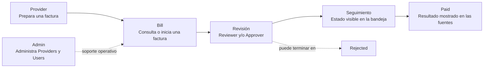

# QUANTIFY
## 00 — Getting Started

> **Tu guía de entrada a la gestión de facturas.**  
> Conoce el recorrido, identifica tu responsabilidad y entra al manual de tu rol.

| Versión | Última actualización | Audiencia |
|---|---|---|
| 0.1 · Borrador | 26 de septiembre de 2026 | Todos los roles |

[← Todas las guías](README.md)

---

## 1. Bienvenido

Quantify reúne en una misma experiencia las facturas y el trabajo de las personas que las preparan, revisan, administran y siguen hasta su pago. La interfaz documentada incluye bandejas de facturas, métricas, gestión de proveedores y usuarios, y reportes.

### En pocas palabras

**Antes:** no hay información confirmada sobre el proceso anterior.  
**Ahora:** Quantify ofrece vistas diferenciadas por rol para consultar y trabajar con facturas. Los permisos y algunos pasos del ciclo todavía requieren validación.

> **Cómo leer esta documentación**  
> Los nombres entre comillas, como `Create Bill +`, `Accept` y `Export CSV`, conservan el texto de la interfaz. Cada procedimiento distingue entre pantalla documentada, preview de diseño y comportamiento pendiente de probar.

## 2. ¿Qué puedo hacer con este sistema?

- Consultar facturas y sus estados desde la bandeja `Bill`.
- Crear una factura desde la experiencia Provider; el formulario y el envío completo aún no están documentados.
- Revisar facturas y consultar `Reports` con filtros y exportación CSV, según la vista documentada para Reviewer.
- Gestionar proveedores y usuarios desde las vistas documentadas para Admin.
- Consultar paneles, ayuda y configuración cuando estén disponibles para el rol.

## 3. Tu recorrido por el sistema

> **Flujo orientativo, no una secuencia certificada.** Las fuentes difieren en el paso de revisión y en los nombres de estado. Consulta [Estados y transiciones](#estados-y-transiciones) antes de interpretar una transición como definitiva.

## 4. Roles y responsabilidades

| Rol | Audiencia | Nivel de acceso documentado | Responsabilidad / acciones visibles | Manual |
|---|---|---|---|---|
| **Super Admin** | Administración de plataforma | El rol aparece en el preview de diseño; permisos por confirmar | En el preview se puede seleccionar una cuenta de demostración. No hay módulos ni permisos confirmados. | [01 · Super Admin](01-super-admin.md) |
| **Admin** | Personal que administra proveedores y usuarios | Acceso a Dashboard, Providers, Bill y Users en el inventario UI/UX | Consultar actividad global; crear/gestionar perfiles de proveedor y usuarios según las vistas documentadas. | [02 · Admin](02-admin.md) |
| **Reviewer** | Personal que consulta facturas y reportes | Bill y Reports en el inventario UI/UX; navegación de Reports discrepante en tests | Revisar la bandeja y analizar actividad. Las acciones de decisión aparecen en tests no ejecutados. | [03 · Reviewer](03-reviewer.md) |
| **Approver** | Persona con rol de aprobación | Rol y pantalla de Bill aparecen en el inventario UI/UX; alcance por validar | La vista documenta facturas `Reviewed` y acciones de aprobación/rechazo. No se solicitó un manual para este rol. | [Validación requerida](#informacion-por-confirmar) |
| **Provider** | Persona que registra y sigue sus facturas | Acceso a Bill y Help; lista de facturas propias según UI/UX | Iniciar una factura con `Create Bill +` y consultar sus registros. El formulario no está descrito. | [04 · Provider](04-provider.md) |

## 5. Conceptos importantes

| Término | Qué significa en la experiencia | Por qué importa |
|---|---|---|
| **Invoice / Bill** | La factura gestionada en Quantify. Las pantallas utilizan principalmente `Bill`; otras fuentes dicen `Invoice`. | El nombre varía entre vistas y material del proyecto. |
| **Provider** | Rol que cuenta con `Create Bill +` y una bandeja descrita como propia. | Es el punto de entrada visible para el registro de facturas. |
| **Reviewer** | Rol con acceso documentado a `Bill` y `Reports`. | Su flujo de aprobación/rechazo debe confirmarse en el entorno operativo. |
| **Approver** | Rol presente en el preview y en el inventario UI/UX. | No debe confundirse con Reviewer: el alcance entre ambos no está resuelto. |
| **Admin** | Rol con vistas de Dashboard, Providers, Bill y Users documentadas. | Su navegación difiere entre el inventario UI/UX y las pruebas automatizadas. |

### Estados y transiciones

Los nombres disponibles en las fuentes no forman todavía una única secuencia confirmada:

| Fuente | Términos que aparecen |
|---|---|
| `CONTEXT.md` | `Draft → Pending → Approved → Paid`; también `Cancelled` y `Rejected` |
| `UI-UX.md` | `Draft`, `Submitted`, `Reviewed`, `Approved`, `Paid`, `Rejected`; y estados de factura/proveedor adicionales |
| Tests de Reviewer | `Submitted` / `Tardy → Approved → Registered → Paid`; también acciones `Accept` y `Decline` |

> ⚠️ **No trates estos nombres como equivalentes.** `Pending` frente a `Submitted`, y `Reviewed` frente a `Approved`, requieren validación con el equipo del producto. `Registered` y `Tardy` aparecen en tests cuya ejecución no está confirmada.

## Matriz de capacidades

Símbolos: ✅ acción o vista documentada · 👁️ consulta documentada · 🔸 aparece en una fuente, pero no está validada operativamente · ❌ acceso expresamente ausente en la pantalla documentada · **?** sin evidencia suficiente.

| Capacidad | Super Admin | Admin | Reviewer | Approver | Provider |
|---|---:|---:|---:|---:|---:|
| Selección de rol/cuenta en preview | 👁️ | 👁️ | 👁️ | 👁️ | 👁️ |
| Dashboard | ? | 👁️ | 👁️ | 👁️ | ❌ |
| Consultar `Bill` | ? | 👁️ | 👁️ | 👁️ | 👁️ |
| Crear factura (`Create Bill +`) | ? | ❌ | ❌ | ❌ | 🔸 |
| Revisar, aprobar o rechazar | ? | ? | 🔸 | 🔸 | ? |
| `Reports` / `Export CSV` | ? | ⚠️ | 👁️ | ❌ | ❌ |
| `Providers` | ? | ✅ | ❌ | ❌ | ❌ |
| `Users & Roles` | ? | ✅ | ❌ | ❌ | ❌ |
| `Help` | ? | 👁️ | 👁️ | 👁️ | 👁️ |
| `Settings` | ? | 👁️ | 👁️ | 👁️ | 👁️ |

**Notas de lectura:** `⚠️` marca una discrepancia concreta: la pantalla Admin documentada no muestra `Reports`, pero la prueba de navegación espera que Admin sí lo tenga. `🔸` significa que el rol y la acción figuran en una fuente, pero la ejecución disponible no demuestra el resultado. `❌` se limita a módulos o acciones expresamente ausentes en las vistas documentadas; no significa que una API haya sido probada.

## 6. Antes de iniciar sesión

### Necesitas

- La URL y el método de acceso aprobados para tu ambiente.
- Una cuenta habilitada para tu rol.
- Confirmar que el ambiente sea el correcto antes de introducir datos.

El contexto del proyecto describe autenticación OIDC con Keycloak; el preview de Lovable muestra un login local y cuentas demo. Son experiencias distintas. **No uses las cuentas del preview como credenciales de producción.**

## 7. ¿Qué debería pasar?

Al entrar, la navegación y las acciones disponibles deberían corresponder al rol asignado. La vista, el saludo y los datos de la bandeja pueden cambiar por rol.

> **Si ves algo diferente...**  
> Confirma primero la URL del ambiente y el rol visible en tu perfil. Si falta un módulo esperado, anota el rol, la pantalla y la acción que intentabas realizar antes de reportarlo.

## 8. Preguntas frecuentes

**¿`Pending` y `Submitted` significan lo mismo?**  
No está confirmado. Las fuentes usan ambos términos; solicita validación antes de inferir equivalencia.

**¿Reviewer y Approver son el mismo rol?**  
No hay evidencia para afirmarlo. El material muestra ambos roles, con bandejas y acciones descritas de forma distinta.

**¿Por qué no tengo `Providers` o `Users`?**  
El inventario UI/UX documenta esos módulos para Admin y no para Reviewer, Approver o Provider. El acceso de Super Admin falta por confirmar.

**¿Dónde encuentro una factura?**  
Abre `Bill` si está disponible en tu navegación. El Provider ve sus facturas según el inventario UI/UX; el alcance de los demás roles debe respetar su configuración.

## Glosario

- **Provider:** persona que inicia y consulta facturas propias en la vista documentada.
- **Reviewer:** rol con `Bill` y `Reports` en el inventario de pantallas.
- **Approver:** rol adicional que aparece en la UI documentada; su relación con Reviewer está por definir.
- **Draft:** estado editable según `CONTEXT.md`; su relación con la etiqueta `Draft` de las vistas requiere validación.
- **Paid:** estado que aparece como final en distintas fuentes, pero cuya transición no está certificada aquí.

## Información por confirmar

| Dato pendiente | Dónde afecta |
|---|---|
| Permisos, módulos y responsabilidad real de Super Admin | Matriz y guía 01 |
| Si Approver requiere su propio manual y cómo se separa de Reviewer | Roles, matriz y flujo end-to-end |
| Secuencia oficial y significado de `Pending`, `Submitted`, `Reviewed`, `Approved`, `Registered`, `Tardy`, `Rejected` y `Paid` | Todos los pasos, resultados y troubleshooting |
| Si el flujo de decisión corresponde a Reviewer, Approver o ambos | Guía 03 y handoff del proceso |
| Diferencia entre login OIDC del contexto y login/cuentas demo del preview | Preparación y acceso |
| Menú final por rol, en especial `Reports` para Admin y opciones de Provider | Matriz y navegación |
| Formulario de creación de factura, validaciones, adjuntos y resultado de `Submit` | Guía 04 y caso end-to-end |
| Transacciones end-to-end verificadas con cuentas autorizadas | Expectativas y casos prácticos |

---

[01 · Super Admin](01-super-admin.md) · [02 · Admin](02-admin.md) · [03 · Reviewer](03-reviewer.md) · [04 · Provider](04-provider.md)
